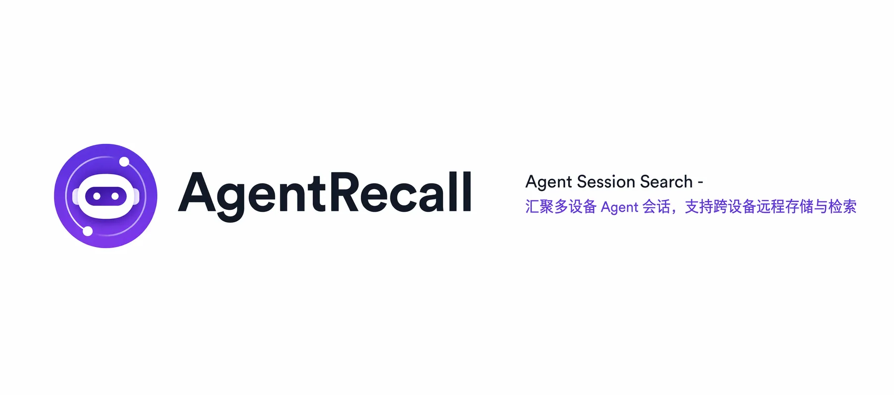
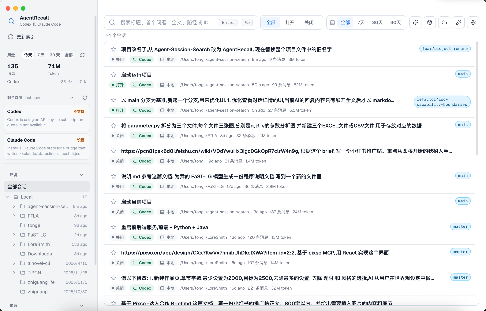
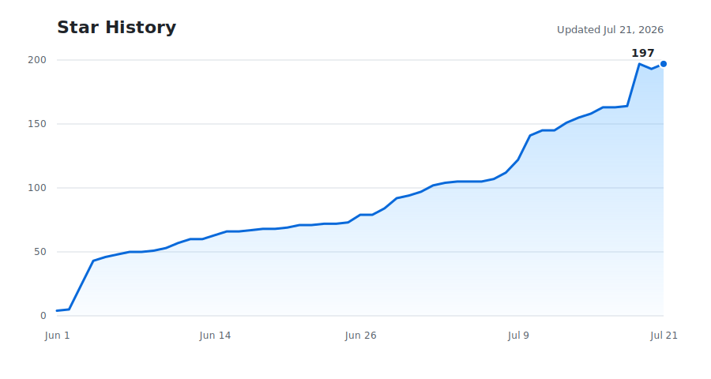

<p align="center">
  
</p>

<h1 align="center">AgentRecall</h1>

<p align="center">本地桌面工具 · 搜索、快速启动、分析多种 AI Coding Agent 会话</p>

<p align="center">
  简体中文 ｜ <a href="./docs/README.en.md">English</a>
</p>

<p align="center">
  
  
  
  
  <a href="https://github.com/zszz3/AgentRecall/stargazers"></a>
  <a href="./LICENSE"></a>
</p>

<p align="center">
  
</p>

## 快速开始

### 普通用户：安装正式版

准备好 **Node.js 22.13 或更高版本**（自带 npm），然后在终端安装 GitHub 最新 Release：

```bash
npm install -g https://github.com/zszz3/AgentRecall/releases/latest/download/agent-recall.tgz
agent-recall
```

这条命令安装的是 Release 中已经编译好的应用，不需要克隆仓库，也不需要执行 `npm run build`。应用会安装到当前 Node.js 的全局 npm 目录，首次启动时会准备当前系统对应的 Electron 运行时；它与本地源码开发目录相互独立，不会覆盖你的代码修改。

| 系统 | 启动命令 | 默认唤起快捷键 |
| --- | --- | --- |
| macOS | `agent-recall` | `⌥ Option + Space` |
| Windows | `agent-recall` | `Ctrl + Alt + Space` |

应用启动后会常驻菜单栏或系统托盘。设置可通过界面入口打开，macOS 也可以使用 `Cmd+,`；全局快捷键、主题和界面语言都可以在设置中修改。

日常使用只需要再次运行 `agent-recall`。终端每天最多检查一次 GitHub Release；发现新版本时会先展示新增功能和问题修复，再由你决定是否安装。也可以主动执行：

```bash
agent-recall --check-update
agent-recall --update
```

App 内的 **设置 → 关于** 也可以检查并安装更新。如果自动更新失败，更新进程会尝试重新打开已经安装的版本，并通过系统提示框提供 Release 下载页和下面这条手动覆盖安装命令：

```bash
npm install -g https://github.com/zszz3/AgentRecall/releases/latest/download/agent-recall.tgz
```

如果终端提示 `agent-recall: command not found`，请确认当前 shell 使用的是安装时的 Node.js 版本。nvm 用户可以执行 `nvm use 22`，或用 `nvm alias default 22` 把 Node 22 设为默认版本。

完整的安装、网络镜像、SSH 依赖、更新和卸载说明见 [Install.md](./Install.md)。

安装指定旧版本或回滚时，把版本号写进 Release 链接，例如：

```bash
npm install -g https://github.com/zszz3/AgentRecall/releases/download/v0.2.0/agent-recall.tgz
```

完整卸载请先运行 `agent-recall uninstall` 清理本应用写入的 statusLine、usage hook、会话同步 Hook、MCP 引用和缓存，再执行 `npm uninstall -g agent-recall`；会话数据库、Supabase 配置和用户偏好会保留。

## 功能

### 核心功能

- **统一搜索和管理多种 AI Coding Agent 会话**：
  搜索、过滤、查看、整理和快速启动 Claude Code、Codex，以及可选的 TClaude、TCodex、CodeBuddy、CodeWiz、OpenClaw、Hermes、OpenCode、ZCode、Cursor Agent、Trae、Qoder 等会话；支持自定义标题、标签、收藏、置顶、隐藏和一键快速启动；也支持本地环境和 SSH 远程环境，远程机器无需安装本应用。侧边栏项目按环境分组展示，每组可折叠，组内按最近活跃时间排序。会话可按全部时间或最近 7 天、30 天或 90 天过滤；搜索结果默认按智能排序（相关性与时间衰减混合），也可切换为按最新或最早活跃时间排序。
- **完整查看会话上下文**：
  详情页展示完整消息、tool call 与 Markdown / code block，并支持查看 AI 摘要和导出 Markdown。
- **AI / Agent 辅助检索历史会话**：
  可以使用 AI 摘要增强历史会话检索，也支持自然语言找会话；同时开放 MCP 能力,让 Claude Code / Codex / CodeBuddy 可以在对话里直接搜索、读取历史会话,并对会话打标签、收藏、设置可见性。
- **跨 Agent 迁移会话**：
  支持在 Claude Code、Codex、CodeBuddy、CodeWiz 及已启用的扩展 CLI 间迁移本地会话；远程恢复支持 Claude Code、Codex、CodeBuddy 和 CodeWiz。
- **远程保存和跨设备恢复会话**：
  支持使用自己的 Supabase 项目手动或自动上传会话快照，在另一台设备搜索远程会话、查看完整详情，并恢复到 Claude Code / Codex / CodeBuddy 中继续工作。
- **统一查看 Agent 用量和额度**：
  统计今日、近 7 天、近 30 天和全部时间的各 Agent token 使用量；同时查看 Claude Code / Codex 的当前额度状态。
- **统一管理 Skills 和 API Provider**：
  查看和管理 Claude Code / Codex skills，统计 skill 使用情况；支持使用自己的 Supabase 项目同步 Skills，在不同机器之间上传、更新和安装；也可以在界面里切换 Codex / Claude Code 的官方账号或第三方 API Provider。

## 支持的数据源

| 来源 | 本地文件 |
| --- | --- |
| Codex CLI | `~/.codex/sessions/**/*.jsonl` |
| Codex Desktop | `~/.codex/sessions/**/*.jsonl`，通过 session metadata 识别 |
| Claude Code CLI | `~/.claude/projects/*/*.jsonl`，以及可选的 `~/.claude/sessions/*.json` 元数据 |
| Claude Desktop app | `~/Library/Application Support/Claude/claude-code-sessions/**/local_*.json`，以及 Claude Code 项目日志 |
| TClaude CLI | 可在设置中开启，读取 `~/.tclaude/projects/*/*.jsonl`（Claude Code 分支，格式一致），支持 Resume |
| TCodex CLI | 可在设置中开启，读取 `~/.tcodex/sessions/**/*.jsonl`（Codex 分支，格式一致），支持 Resume |
| Claude Code Internal | 可在设置中开启，读取 `~/.claude-internal/projects/*/*.jsonl` |
| Codex Internal | 可在设置中开启，读取 `~/.codex-internal/sessions/**/*.jsonl` |
| CodeBuddy CLI | 可在设置中开启，读取 `~/.codebuddy/projects/**/*.jsonl` |
| CodeWiz | 可在设置中开启，读取 `~/.local/share/codewiz/opencode.db`，支持 Resume |
| OpenClaw | 可在设置中开启，读取 `~/.openclaw/agents/*/sessions/*.jsonl`，兼容 `~/.clawdbot/agents/*/sessions/*.jsonl`，排除 `*.trajectory.jsonl` |
| Hermes | 可在设置中开启，读取 `~/.hermes/state.db` |
| OpenCode | 可在设置中开启，读取 `~/.local/share/opencode/opencode.db` |
| ZCode | 可在设置中开启，以只读方式读取 `~/.zcode/cli/db/db.sqlite`，支持工具记录和 Token 统计；详情中可明确确认后删除单个本地会话 |
| Cursor Agent | 可在设置中开启，读取 `~/.cursor/projects/**/agent-transcripts/**/*.jsonl` |
| Trae | 可在设置中开启，读取 `~/.trae-cn/memory/projects/**/session_memory_*.jsonl`；打开状态会读取 Trae workspace 的本地状态库 |
| Qoder | 可在设置中开启，读取 `~/.qoder/cache/projects/*/conversation-history/*/*.jsonl`；支持 Live 检测和远程同步 |
| SSH 远程环境 | 通过 SSH 读取远端用户目录下同样的 Codex / Claude Code session 路径 |

当 `~/.codex/session_index.jsonl` 存在时，应用会读取 Codex 的标题元数据。没有上游标题时，会使用第一个有效用户问题作为默认标题。

CodeBuddy CLI、CodeWiz、TClaude、TCodex、Claude Code Internal、Codex Internal、OpenClaw、Hermes、OpenCode、ZCode、Cursor Agent、Trae 和 Qoder 默认关闭，可在 Settings -> Optional sources 里选择监测。开启后支持本地索引、搜索、详情查看和来源过滤；其中 TClaude / TCodex 因为与 Claude Code / Codex 格式一致，额外支持 Resume 和一键启动（分别调用 `tclaude` / `tcodex` 命令），CodeWiz 支持本机和 SSH 远程会话索引、详情查看、Resume、迁移与恢复，ZCode 额外支持本地工具调用记录和按时间范围统计 Token。ZCode 不支持 Resume、会话迁移、SSH、远程同步、打开 ZCode 或额度查询；删除 ZCode 会话时只删除明确选中的会话及其关联记录，不删除共享数据库文件。OpenClaw 等其他来源的 Resume、远程 SSH 同步和专属用量统计会后续按来源单独补齐。Trae 和 Qoder 额外支持打开状态检测。

## 远程会话同步

远程会话同步用于把本机某段会话保存到你自己的 Supabase 项目里。另一台设备配置同一个 Supabase URL 和 anon key 后，可以打开远程会话列表，搜索、按来源筛选、查看详情，并把远程会话恢复到本机任意支持的 Agent 中。比如设备 A 上传了一段 Codex 会话，设备 B 可以在远程会话列表里查看这段会话，并选择恢复到 Claude Code、Codex 或 CodeBuddy。

当前版本按**单人使用、由用户控制同步**设计：

- 不做用户隔离，也不需要登录系统；默认使用你自己的 Supabase 项目和 anon key。
- 默认使用手动上传。也可以在设置中安装 Claude Code 与 Codex 会话 Hook；每轮回复完成后 Hook 只记录待同步会话，由常驻托盘的 App 按稳定内容 revision 更新云端。App 未运行时会在下次启动后继续处理。
- 自动同步不会覆盖内容冲突；本地和云端都改变时仍需在同步窗口中人工选择处理方式。关闭远程会话同步或点击“移除 Hook”会清理本应用安装的 Hook，不会删除云端数据。
- 同步窗口会同时读取全部可同步的本地会话和云端副本，显示“仅本地、待更新云端、已同步、云端较新、仅云端、内容冲突”；判断依据是稳定内容 revision，而不是设备路径、上传时间或修改时间。
- 本地和云端都改变时会标记冲突，批量上传自动跳过；只有用户明确选择覆盖云端时才会覆盖。
- 顶部支持全选当前结果、批量上传和批量删除云端副本。删除云端副本不会删除本地会话；恢复永远创建新的本地副本。
- 远程详情包含会话元数据、消息、tool call / trace event、标签和 AI summary 等当前详情页支持的信息。
- 恢复时会使用远程保存的 portable session，并要求在当前设备选择一个本地项目目录作为恢复目标路径。

### 配置 Supabase

1. 在 [Supabase Dashboard](https://supabase.com/dashboard) 创建或选择一个自己的项目。
2. 在 Project Settings -> API 中复制 Project URL 和 anon key。
3. 回到应用的 Settings -> Remote sync，开启远程会话同步，再填入 Supabase URL 和 anon key。
4. 在“首次配置”中点击“复制最新 SQL”，再点击“打开 SQL Editor”；应用会直接打开当前 Supabase 项目的 SQL Editor。
5. 粘贴并执行 SQL，回到应用即可手动上传和恢复。会话或 Skills 页面以后提示结构或权限需要更新时，按同样步骤执行对应页面提供的最新 SQL，再点击刷新即可。
6. 如需自动同步，点击“安装 Hook”。Codex 首次使用时会提示审查 Hook，请在 Codex 中执行 `/hooks` 并确认信任；Claude Code 与 Codex 的其他 Hook 配置会保留。

首次配置 SQL 会一次初始化会话和 Skills 同步；其中会话同步会创建：

- 表：`public.agent_session_remote_sessions`
- Storage bucket：`agent-session-remote`
- Storage 对象路径：
  - `sessions/{id}/detail.json`：用于远程详情查看
  - `sessions/{id}/portable.json`：用于跨设备、跨 Agent 恢复

脚本是幂等的，可以重复执行。它会为 anon role 创建适合个人项目的读写策略。这个策略方便单人同步，但不是多用户隔离方案；如果要多人共享或公开分发，请先按自己的 Supabase 安全模型调整 RLS policy。

### 上传会话

打开顶部的 Session sync / 会话同步窗口，直接选择“仅本地”或“待更新云端”的会话并点击“上传到云端”。该窗口读取本机全部可同步会话，不受主界面当前搜索、筛选或选中状态影响。

如果同一段会话已经上传过：

- 内容没变：提示远程会话已经是最新。
- 内容有变化：更新远程表记录和 Storage 中的 `detail.json` / `portable.json`。

### 搜索、查看和恢复远程会话

点击顶部工具栏的云图标打开 Remote Sessions：

- 使用搜索框按标题、项目路径、摘要、标签和全文搜索远程会话。
- 使用 Source / 来源筛选只看 Claude、Codex 或 CodeBuddy 上传的会话。
- 点击 View / 查看可以打开远程详情页；这个详情页是只读的。
- 在 Restore to / 恢复到 中选择目标 Agent，再点击某条会话的 Restore。
- 第一次恢复时需要选择当前设备上的本地项目目录；恢复完成后会写入目标 Agent 的本机会话目录，并尝试启动对应 Agent 继续工作。

## MCP 工具

应用内置一个 stdio MCP 服务器（`agent-recall-mcp`），让 Claude Code / Codex / CodeBuddy 在对话里直接搜索、读取历史会话，并管理标签、收藏、可见性，以及跨 Agent 迁移会话。首次打开应用后会自动写入数据库指针（`~/.agent-recall/db-path`），MCP 服务器据此找到当前数据库；也可用 `AGENT_RECALL_DB` 环境变量覆盖。

读取工具：

- `search_sessions` — 按关键词搜索历史会话（标题、首问、全文、AI 摘要）。
- `get_session` — 按 `sessionKey` 取单个会话的元数据、AI 摘要和消息（支持 `offset` 分页）。
- `list_projects` / `list_tags` — 列出已索引的项目和标签，用于缩小搜索范围。

写入工具：

- `tag_session` — 给会话增删标签（幂等）。
- `toggle_favorite` — 收藏 / 取消收藏会话。
- `set_visibility` — 设置会话可见性维度（`default` / `favorites` / `hidden` / `pinned`）。
- `migrate_session` — 把一个**本地**会话（`environmentKind=local`）迁移到目标 Agent（`claude` / `codex` / `codebuddy` / `codewiz` / `cursor`，以及已启用的扩展目标）。写入目标会话文件、立即索引入库、记录 `session_migrations` 历史，并返回可执行的 `resumeCommand`。**该工具不会自动打开终端**（返回结果里 `launched` 恒为 `false`），需要你自行运行返回的 `resumeCommand`。

  长会话会自动压缩：优先用 Settings 里配置的自定义摘要 API（`summarySource=custom`），否则回退到 `codex exec --ephemeral` / `claude --print`；压缩 provider 不可用时稳定回退到 `locally-truncated`。压缩过程中产生的临时 summary 会话会即时从数据库清除，不会残留脏数据。

  MCP 服务器读取应用的配置文件（`~/Library/Application Support/AgentRecall/config.json`，可用 `AGENT_RECALL_CONFIG` 覆盖路径）来判断摘要来源，并从数据库的 `api_provider_keys` 表补回自定义摘要 API 的密钥。

## Skills 管理与同步

打开 Skills 管理窗口后，可以查看本机已安装的 Codex / Claude Code Skills，按来源筛选，查看使用次数，预览 `SKILL.md` 内容，并对非系统 Skill 执行删除、复制路径、在 Finder / 文件管理器中打开等操作。

如果希望在多台机器之间同步自己的 Skills，可以在 Settings -> Skills -> Supabase skill sync 中启用 Supabase 同步：

1. 在 [Supabase Dashboard](https://supabase.com/dashboard) 创建或选择一个自己的项目。
2. 在 Project Settings -> API 中复制 Project URL 和 anon key。
3. 回到应用的 Settings -> Skills，填入 Supabase URL 和 anon key；“首次配置”提供与会话同步相同的组合 SQL，并可直接打开当前项目的 SQL Editor。
4. 执行 SQL 后启用同步。如果表、Storage bucket、字段或权限以后需要更新，Local 页会显示修复提示；点击“复制最新 SQL”和“打开 SQL Editor”，执行后原地刷新。配置健康前不会出现 Remote 标签，也不会把本地 Skill 误标为“未上传”。
5. Local 页只允许同步 Codex user、Claude user 和 Shared Skills，并显示未上传、已同步、本地较新、云端较新或冲突。System、Project 和 Claude Plugin Skills 分别交给系统、Git 和插件管理器，不参与上传。
6. Remote 页支持多选、下载全部和删除云端选中。下载全部只安装远程独有或明确云端较新的最新版；已同步、本地较新、冲突和旧版不兼容记录会跳过并汇总原因。

同步会上传整个 Skill 目录中的普通文件，包括 `SKILL.md`、`references/`、`scripts/`、示例文件等。云端只保存可移植作用域和相对目录，不保存上传设备的绝对路径；下载时按 `codex-user` → `$CODEX_HOME/skills`、`claude-user` → `~/.claude/skills`、`shared` → `~/.agents/skills` 定位，因此换设备或跨 macOS / Windows 不会沿用旧机器路径。同名 Skill 也会按作用域和相对目录区分。

如果你在更早版本里已经创建过 `agent_recall_skills` 表，升级后请重新执行一次 Copy setup SQL 的脚本来启用版本历史；脚本是幂等的，会补上 `content_hash` 列，并把唯一约束从 `local_fingerprint` 改为 `(local_fingerprint, version)`。

当前 Supabase 同步按个人项目设计，不会自动创建表，也不会使用 service role key。应用只保存 Project URL 和 anon key 到本地设置，并通过 Supabase REST API 访问 `agent_recall_skills` 表。初始化 SQL 会为 anon role 创建可读写策略，适合个人私有项目或仅自己掌握 URL/key 的项目；如果要多人共享或公开分发，请先按自己的 Supabase 安全模型调整 RLS policy。

## 开发者本地运行

开发环境需要 macOS 或 Windows、Git、Node.js 22.13+ 和 npm。首次准备仓库：

```bash
git clone https://github.com/zszz3/AgentRecall.git
cd AgentRecall
npm ci
npm run dev
```

`npm run dev` 会启动 Electron 开发版并监听源码变化。开发版直接使用当前仓库文件，不会读取或覆盖全局安装的正式版；两者的代码位置彼此独立。

常用开发命令：

| 命令 | 用途 |
| --- | --- |
| `npm run dev` | 启动本地开发版 |
| `npm test` | 运行全部自动化测试 |
| `npm run typecheck` | 检查主进程和渲染进程 TypeScript 类型 |
| `npm run build` | 生成生产构建到 `out/` |
| `npm run release-note:check` | 检查当前开发分支的用户更新说明 |

需要验证正式安装包时，使用仓库提供的隔离冒烟测试：

```bash
npm run build
npm run package:smoke
```

它会把生成的 tarball 安装到临时 HOME 和临时 npm prefix，验证命令后自动清理，不会改动开发者正在使用的全局 Node.js 目录。普通用户应始终使用上方的 Release 链接安装。更完整的环境检查和故障排查见 [Install.md](./Install.md)。

## 仓库文档

- `README.md`：中文项目说明，面向普通读者和开发者。
- `docs/README.en.md`：英文项目说明。
- `Install.md`：安装、更新、卸载说明，也包含给 Coding Agent 安全初始化项目环境的执行文档。
- `start.sh`：macOS 一键启动脚本，自动检查环境、安装缺失依赖并启动应用。

## 开源协议

本项目基于 [MIT License](./LICENSE) 开源。你可以自由使用、修改和分发本项目，但需要保留原始版权声明和许可声明。

## 贡献者

### Collaborators

<!-- readme: collaborators -start -->
<table>
	<tbody>
		<tr>
            <td align="center">
                <a href="https://github.com/Blue-Berrys">
                    
                    <br />
                    <sub><b>Blue-Berrys</b></sub>
                </a>
            </td>
            <td align="center">
                <a href="https://github.com/G-Pegasus">
                    
                    <br />
                    <sub><b>G-Pegasus</b></sub>
                </a>
            </td>
            <td align="center">
                <a href="https://github.com/zszz3">
                    
                    <br />
                    <sub><b>zszz3</b></sub>
                </a>
            </td>
            <td align="center">
                <a href="https://github.com/mesakurax">
                    
                    <br />
                    <sub><b>mesakurax</b></sub>
                </a>
            </td>
            <td align="center">
                <a href="https://github.com/LANSGANBS">
                    
                    <br />
                    <sub><b>LANSGANBS</b></sub>
                </a>
            </td>
            <td align="center">
                <a href="https://github.com/forbbiden1">
                    
                    <br />
                    <sub><b>forbbiden1</b></sub>
                </a>
            </td>
		</tr>
		<tr>
            <td align="center">
                <a href="https://github.com/MeloMei">
                    
                    <br />
                    <sub><b>MeloMei</b></sub>
                </a>
            </td>
		</tr>
	<tbody>
</table>
<!-- readme: collaborators -end -->

### Contributors

<!-- readme: contributors -start -->
<table>
	<tbody>
		<tr>
            <td align="center">
                <a href="https://github.com/Blue-Berrys">
                    
                    <br />
                    <sub><b>Blue-Berrys</b></sub>
                </a>
            </td>
            <td align="center">
                <a href="https://github.com/zszz3">
                    
                    <br />
                    <sub><b>zszz3</b></sub>
                </a>
            </td>
            <td align="center">
                <a href="https://github.com/mesakurax">
                    
                    <br />
                    <sub><b>mesakurax</b></sub>
                </a>
            </td>
            <td align="center">
                <a href="https://github.com/MeloMei">
                    
                    <br />
                    <sub><b>MeloMei</b></sub>
                </a>
            </td>
            <td align="center">
                <a href="https://github.com/G-Pegasus">
                    
                    <br />
                    <sub><b>G-Pegasus</b></sub>
                </a>
            </td>
            <td align="center">
                <a href="https://github.com/LANSGANBS">
                    
                    <br />
                    <sub><b>LANSGANBS</b></sub>
                </a>
            </td>
		</tr>
		<tr>
            <td align="center">
                <a href="https://github.com/wanglongze123">
                    
                    <br />
                    <sub><b>wanglongze123</b></sub>
                </a>
            </td>
            <td align="center">
                <a href="https://github.com/CuSO41108">
                    
                    <br />
                    <sub><b>CuSO41108</b></sub>
                </a>
            </td>
            <td align="center">
                <a href="https://github.com/wlh26">
                    
                    <br />
                    <sub><b>wlh26</b></sub>
                </a>
            </td>
		</tr>
	<tbody>
</table>
<!-- readme: contributors -end -->

## Star History

<a href="https://www.star-history.com/?repos=zszz3%2FAgentRecall&type=date&legend=top-left">
  
</a>

有任何问题，请提交issue。如果觉得我们的项目还不错，欢迎star✨。
